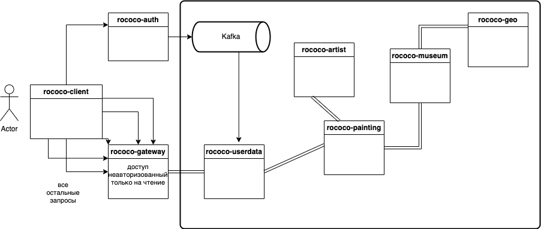
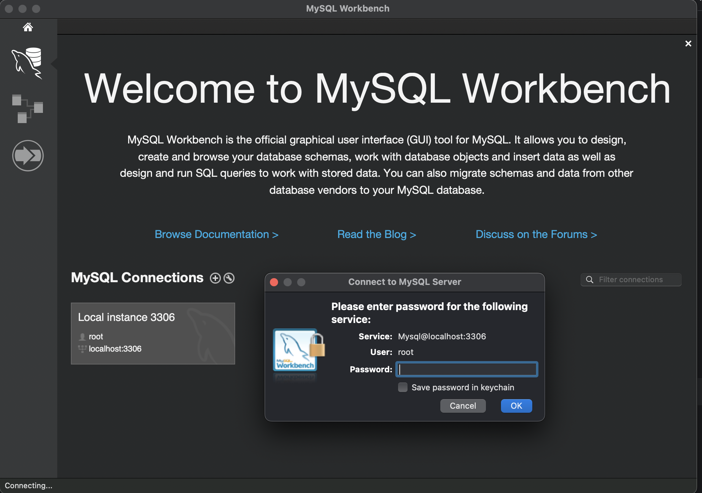

# Rococo

## Схема сервисов:



### Запустить приложение на моках, чтобы посмотреть, как ДОЛЖНО работать:

- Запустить моки ([папка с моками](wiremock))

```bash
bash wiremock.sh
```
- Запустить фронтенд

```bash
cd ./rococo-client
npm i
npm run dev
```
Фронт стартанет на порту 3000: http://127.0.0.1:3000/

**Минимальные предусловия для работы с проектом Rococo**

#### 0. Установить docker (Если не установлен)

Мы будем использовать docker для БД (MySQL), кроме того, будем запускать микросервисы в едином docker network при
помощи docker-compose

[Установка на Windows](https://docs.docker.com/desktop/install/windows-install/)

[Установка на Mac](https://docs.docker.com/desktop/install/mac-install/) (Для ARM и Intel разные пакеты)

[Установка на Linux](https://docs.docker.com/desktop/install/linux-install/)

После установки и запуска docker daemon необходимо убедиться в работе команд docker, например `docker -v`:

```bash
docker -v
```

#### 0.1 Спуллить контейнер mysql:8.0.33, zookeeper и kafka версии 7.3.2

```posh
docker pull mysql:8.0.33
docker pull confluentinc/cp-zookeeper:7.3.2
docker pull confluentinc/cp-kafka:7.3.2
```

После `pull` вы увидите спуленный image командой `docker images`

```bash
docker images            

REPOSITORY                 TAG              IMAGE ID       CREATED         SIZE
mysql                      8.0.33           9f3ec01f884d   10 days ago     379MB
confluentinc/cp-kafka      7.3.2            db97697f6e28   12 months ago   457MB
confluentinc/cp-zookeeper  7.3.2            6fe5551964f5   7 years ago     451MB
```
#### 0.2 Установить одну из программ для визуальной работы с MySQL

Например, DBeaver или Datagrip. Можно MySQLWorkbench.

#### 0.3 Запустить mysql

```bash
sudo /usr/local/mysql/support-files/mysql.server start
```

Подключиться к запущенному серверу MySQL с паролем, выбранным в процессе установки MySQL,
пользователем root из MySQLWorkbench



Создать базы данных для всех сервисов

```sql
create
    database "rococo-userdata";
create
    database "rococo-artist";
create
    database "rococo-geo";
create
    database "rococo-museum";
create
    database "rococo-painting";
create
    database "rococo-auth";
```

#### 0.4 Установить Java версии 17 или новее. Это необходимо, т.к. проект не поддерживает версии <17

Версию установленной Java необходимо проверить командой `java -version`

```bash
java -version
```

Если у вас несколько версий Java одновременно - то хотя бы одна из них должна быть 17+
Если java не установлена вовсе, то рекомендую установить OpenJDK (например, из https://adoptium.net/en-GB/)

#### 0.5 Установить пакетый менеджер для сборки front-end npm

[Инструкция](https://docs.npmjs.com/downloading-and-installing-node-js-and-npm).
Рекомендованная версия Node.js - 18.13.0 (LTS)

### Запустить приложение, написанное мной, локально:

#### 1. Создать volume для сохранения данных из БД в docker на вашем компьютере

```bash
docker volume create rococo
```

#### 2. Запустить скрипт поднятия локального окружения

```bash
bash localenv.sh
```
Фронт стартанет на порту 3000: http://127.0.0.1:3000/

#### 3. Прописать run конфигурацию для всех сервисов rococo-* - Active profiles local

Для этого зайти в меню Run -> Edit Configurations -> выбрать main класс -> указать Active profiles: local

#### 4. Запустить сервис rococo-auth c помощью gradle или командой Run в IDE:

Запустить сервис auth командой

```bash
cd rococo-auth
gradle bootRun --args='--spring.profiles.active=local'
```

Или просто перейдя к main-классу приложения RococoAuthApplication выбрать run в IDEA (предварительно удостовериться что
выполнен предыдущий пункт)

#### 5. Запустить в любой последовательности другие сервисы rococo-userdata, rococo-gateway, rococo-artist, rococo-geo, rococo-museum, rococo-painting

Командой или перейдя к main-классам каждого сервиса (см предыдущий пункт)

# Запуск Rococo в докере:

#### 1. Создать бесплатную учетную запись на https://hub.docker.com/ (если отсутствует)

#### 2. Создать в настройках своей учетной записи access_token

[Инструкция](https://docs.docker.com/docker-hub/access-tokens/).

#### 3. Выполнить docker login с созданным access_token (в инструкции это описано)

#### 4. Прописать в etc/hosts элиас для Docker-имени

#### frontend:  127.0.0.1 client.rococo.dc

#### auth:      127.0.0.1 auth.rococo.dc

#### gateway:   127.0.0.1 gateway.rococo.dc

```bash
vi /etc/hosts
```

```bash
##
# Host Database
#
# localhost is used to configure the loopback interface
# when the system is booting.  Do not change this entry.
##
127.0.0.1       localhost
127.0.0.1       client.rococo.dc
127.0.0.1       auth.rococo.dc
127.0.0.1       gateway.rococo.dc
```

#### 5. Перейти в корневой каталог проекта

```bash
cd rococo
```

#### 6. Запустить все сервисы:

```bash
bash docker-compose-dev.sh
```

Rococo при запуске в докере будет работать для вас по адресу http://client.rococo.dc/

# Создание своего docker repository для форка Rococo и сборка своих докер контейнеров

#### 1. Войти в свою УЗ на https://hub.docker.com/ и последовательно создать публичные репозитории

- rococo-client
- rococo-userdata
- rococo-gateway
- rococo-auth
- rococo-artist
- rococo-geo
- rococo-museum
- rococo-painting

Допустим, что ваш username на https://hub.docker.com - *foobazz*

#### 2. заменить в проекте все имена image ev1av1ness/rococo на foobazz/rococo

- где foobazz - ваш юзернэйм на https://hub.docker.com/

#### 3. Перейти в корневой каталог проекта

```bash
cd rococo
```

#### 4. Собрать все имеджи, запушить и запустить rococo одной командой, если необходим фронтенд GraphQL, то это указывается аргументом к скрипту:

```bash
bash docker-compose-dev.sh push
```