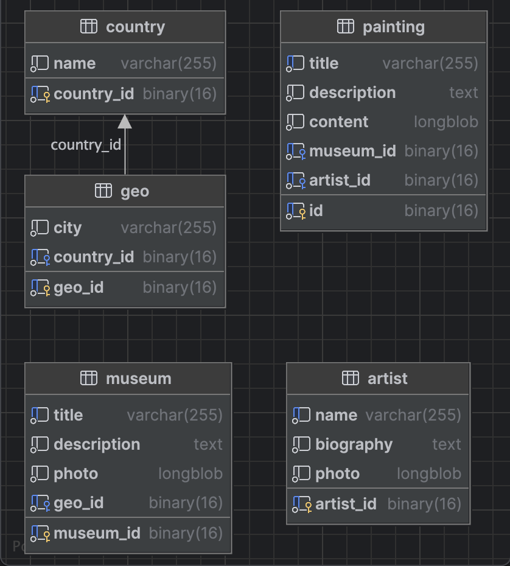

# Rococo

## Схема cущностей:



## Схема сервисов:


### Запустить приложение на моках, чтобы посмотреть, как ДОЛЖНО работать:

- Запустить моки ([папка с моками](wiremock))

```bash
bash wiremock.sh
```
- Запустить фронтенд

```bash
cd ./rococo-client
npm i
npm run dev
```
Фронт стартанет на порту 3000: http://127.0.0.1:3000/

### Запустить приложение, написанное мной, локально:

#### 1. Создать volume для сохранения данных из БД в docker на вашем компьютере

```bash
docker volume create rococo
```

#### 2. Запустить скрипт поднятия локального окружения

```bash
bash localenv.sh
```
Фронт стартанет на порту 3000: http://127.0.0.1:3000/

#### 3. Прописать run конфигурацию для всех сервисов rococo-* - Active profiles local

Для этого зайти в меню Run -> Edit Configurations -> выбрать main класс -> указать Active profiles: local

#### 4. Запустить сервис rococo-auth c помощью gradle или командой Run в IDE:

Запустить сервис auth командой

```bash
cd niffler-auth
gradle bootRun --args='--spring.profiles.active=local'
```

Или просто перейдя к main-классу приложения RococoAuthApplication выбрать run в IDEA (предварительно удостовериться что
выполнен предыдущий пункт)

#### 5. Запустить в любой последовательности другие сервисы

Командой или перейдя к main-классам каждого сервиса (см предыдущий пункт)


## Каким было задание:
#### Подумать о необходимых микросервисах.

У вас должен быть гейтвей, куда будет ходить фронт, он будет играть роль прокси,
проверяющего вашу аутентификацию. Это значит, что основная логика уйдет в свои
микросервисы со своими БД. На мой взгляд, здесь будут уместны сервисы rococo-artist,
rococo-painting, rococo-museum, rococo-userdata. Возможно, у вас другие мысли, какие микросервисы создать - вы
можете проявить свою фантазию

##### Особенности реализации backend

###### Сервис gateway

1) Pageble контроллеры;
Пример:
```java
  @GetMapping()
  public Page<ArtistJson> getAll(@RequestParam(required = false) String name,
                                 @PageableDefault Pageable pageable) {
    return artistService.getAll(name, pageable);
  }
```
Здесь объект `Pageable` - приходит в виде GET параметров с фронта. 
Так же GET парметром может прийти (а может и нет) параметр name. Тогда запрос в БД должен включать фильтрацию по полю name (`ContainsIgnoreCase`)
Пример репозитория с запросом к БД с учетом Pageable и name
```java
public interface ArtistRepository extends JpaRepository<ArtistEntity, UUID> {

  @Nonnull
  Page<ArtistEntity> findAllByNameContainsIgnoreCase(
          @Nonnull String name,
          @Nonnull Pageable pageable
  );
}
```
Почитать, дополнительно, тут: https://www.baeldung.com/spring-data-jpa-pagination-sorting


2) необходим доступ без авторизации к эндпойнту `/api/session` без необходимости быть
аторизованным, для этого пропишем его в security config:
```java
@EnableWebSecurity
@Configuration
@Profile("!local")
public class SecurityConfigMain {

    private final CorsCustomizer corsCustomizer;

    @Autowired
    public SecurityConfigMain(CorsCustomizer corsCustomizer) {
        this.corsCustomizer = corsCustomizer;
    }

    @Bean
    public SecurityFilterChain securityFilterChain(HttpSecurity http) throws Exception {
        corsCustomizer.corsCustomizer(http);

        http.authorizeHttpRequests(customizer ->
                customizer.requestMatchers(
                                antMatcher(HttpMethod.GET, "/api/session"),
                                antMatcher(HttpMethod.GET, "/api/artist/**"),
                                antMatcher(HttpMethod.GET, "/api/museum/**"),
                                antMatcher(HttpMethod.GET, "/api/painting/**"))
                        .permitAll()
                        .anyRequest()
                        .authenticated()
        ).oauth2ResourceServer((oauth2) -> oauth2.jwt(Customizer.withDefaults()));
        return http.build();
    }
}
```
Все прочие эндпойнты должны требовать авторизацию


